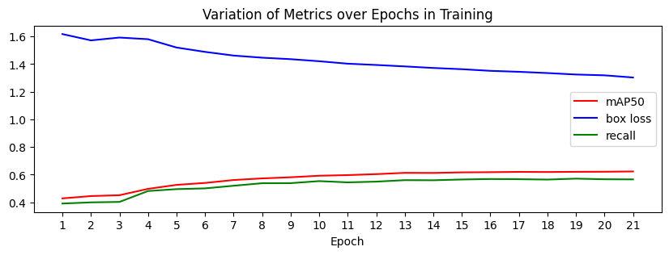

# Vayu - Decoding the Planet, One Insight at a Time

> An AI-powered environmental monitoring platform for Indian cities. Connects real-time air quality data, personal carbon impact, green cover analysis, and computer vision-based pollution detection into one unified system.

Live at: **[vayuapp.online](https://vayuapp.online)**

---

## The Problem

Indian cities consistently rank among the worst in global air quality. Most people understand AQI as just a number, not as a health threat. Pollution sources are visible on the street but their connection to climate change isn't. Personal environmental impact is largely ignored or misunderstood.

*Data exists, but insight doesn't.*

Vayu bridges that gap by turning raw data into something people can actually understand and act on.

---

## Features

### AQI Dashboard
Real-time air quality data for 18+ Indian and global cities, fetched from the [WAQI API](https://waqi.info/). Visualised using Plotly with:
- AQI gauge chart for single-city view
- Radar chart comparing live pollutant levels (PM2.5, PM10, SO2, NO2, O3, CO) against WHO safe limits
- Horizontal bar chart overlaying actual vs. WHO values
- Multi-city AQI comparison bar chart
- AI-generated overview card summarising air quality in plain language

### Pollution Source Detector
A YOLOv8-based computer vision model that identifies pollution sources vehicles, garbage, smoke, and fire from any uploaded image. Trained on 53,000+ real-world images of Indian street scenes. See the [How the Pollution Detector Works](#how-the-pollution-detector-works) section for the full architecture.

### Green Cover vs Air Quality Map
An interactive folium map overlaying live WAQI station AQI readings with NDVI (Normalized Difference Vegetation Index) data for major Indian cities. Visualises the relationship between tree cover density and local air quality in real time.

### Carbon Footprint Calculator
Estimates monthly personal CO2 emissions based on commute mode and distance, electricity usage, LPG consumption, diet, and waste output. Uses India-specific emission factors. Results are summarised by an AI overview card comparing your footprint to celebrity lifestyles for scale.

### Vayu Chatbot
A conversational assistant powered by GPT contextualised specifically for Indian air quality, AQI interpretation, pollutant health effects, and carbon footprint advice. Refuses off-topic queries and stays grounded in real data.

---

## Architecture

Vayu is split into two independently deployed services.

```
┌──────────────────────────────────────┐
│        Streamlit Frontend            │
│          (Render)                    │
│                                      │
│  Landing │ Dashboard │ Detector │... │
│                                      │
│  Sends POST/GET requests with JSON   │
│  payloads to FastAPI backend         │
└────────────────┬─────────────────────┘
                 │  HTTPS FAST API
                 │  (JSON over HTTP)
┌────────────────▼─────────────────────┐
│         FastAPI Backend              │
│       (Hugging Face Spaces)          │
│                                      │
│  /chat          → GPT chatbot        │
│  /dashboard_overview → AI summary    │
│  /co2_overview  → AI carbon card     │
│  /cv_predict    → YOLOv8 inference   │
│  /health        → keep-alive ping    │
└──────────────────────────────────────┘
```

### Frontend | Streamlit on Render

The Streamlit app is deployed on Render's free tier. It handles all UI, user input, and data visualisation. API calls to the FastAPI backend are made using Python's `requests` library with JSON payloads. The `FASTAPI_URL` environment variable points the frontend to the backend URL on Hugging Face Spaces.

A cron job pings the `/health` endpoint every 14 minutes to prevent Render's free tier from spinning down the container.

### Backend | FastAPI on Hugging Face Spaces

The FastAPI server runs in a Docker container on Hugging Face Spaces (port 7860). It handles all heavy computation: YOLOv8 inference, Gemini API calls, and image processing. Keeping inference server-side avoids shipping the ~18MB model weights to the frontend.

The backend exposes the following endpoints:

| Endpoint | Method | Description |
|---|---|---|
| `/` | GET | Status check |
| `/health` | GET | Keep-alive ping |
| `/chat` | POST | Gemini chatbot response |
| `/dashboard_overview` | POST | AI AQI summary card |
| `/co2_overview` | POST | AI carbon footprint card |
| `/cv_predict` | POST | YOLOv8 pollution detection |

---

## How the Pollution Detector Works

The detector uses a request-response cycle where images are serialised as Base64 strings to travel safely over JSON between the frontend and backend.

```
FRONTEND (Streamlit on Render)
│
│  User uploads image (JPG/PNG)
│
▼
┌─────────────────────────────────┐
│  Image opened with PIL          │
│  Written to in-memory buffer    │
│  Encoded to Base64 string       │
└────────────────┬────────────────┘
                 │
                 │  POST /cv_predict
                 │  { "image": "<base64_string>" }
                 │
                 ▼
BACKEND (FastAPI on Hugging Face Spaces)
                 │
┌────────────────▼────────────────┐
│  Base64 string decoded          │
│  to raw bytes                   │
│                                 │
│  Bytes opened with PIL          │
│  Converted to NumPy array       │
│                                 │
│  YOLOv8 (ONNX) runs inference   │
│  on the array                   │
│                                 │
│  model.predict() returns        │
│  bounding boxes, class labels,  │
│  and confidence scores          │
│                                 │
│  result[0].plot() draws         │
│  annotations onto the image     │
│  and returns a NumPy array      │
│                                 │
│  Annotated array converted      │
│  back to PIL Image              │
│  Saved to in-memory buffer      │
│  Encoded to Base64 string       │
└────────────────┬────────────────┘
                 │
                 │  { "annotated_image": "<base64_string>" }
                 │
                 ▼
FRONTEND (Streamlit on Render)
│
│  Base64 decoded to bytes
│  Bytes opened with PIL
│  Displayed with st.image()
│
▼
┌─────────────────────────────────┐
│  User sees annotated image      │
│  with bounding boxes and labels │
│  next to the original           │
└─────────────────────────────────┘
```

No image files are written to disk at any point. The entire pipeline runs in memory using `io.BytesIO` buffers, which is what makes it work cleanly in a serverless container environment.

---

## The Model

Vayu uses a YOLOv8n (nano) model exported to ONNX format for fast, dependency-light inference.

### Training

- Base model: `yolov8n.pt` (pretrained on COCO)
- Dataset: ~53,000 labelled images sourced from Roboflow, covering Indian street scenes across multiple cities and lighting conditions
- Detected classes: **Vehicles, Garbage, Smoke, Fire**
- Image size: 640×640
- Epochs: 25 (v1) with extended fine-tuning run (v2)
- Batch size: 16
- Augmentation: HSV jitter, mosaic, horizontal flip, random erasing, randaugment
- Training platform: Kaggle (dual T4 GPUs)

The detection threshold is tuned for high recall prioritising catching every potential pollution source over minimising false positives, which is the correct tradeoff for real-world environmental monitoring.

### Model Versions

| Version | Notes |
|---|---|
| vayu_v1 | Initial 25-epoch training run |
| vayu_v2 | Extended fine-tuning from v1 checkpoint with adjusted learning rate |

Both versions export `best.pt` and `best.onnx`. The ONNX model is used in production via `onnxruntime` to avoid the full PyTorch dependency on the inference server.

---

## Project Structure

```
vayu/
├── fastapi_server/
│   └── server.py              # FastAPI backend (Hugging Face Spaces)
│
├── streamlit-app/
│   ├── Landing.py             # Home page
│   ├── pages/
│   │   ├── 1_Dashboard.py     # AQI Dashboard
│   │   ├── 2_Pollution_Source_Detector.py
│   │   ├── 3_Green_Cover_vs_Air_Quality.py
│   │   ├── 4_Chat.py          # Vayu chatbot
│   │   └── 5_Carbon_Footprint_Calculator.py
│   └── utils/
│       ├── aqi.py             # WAQI API wrapper + AQI color logic
│       ├── co2_calc.py        # Carbon emission factors + calculator
│       ├── ndvi_map.py        # Folium map builder
│       ├── ndvi_extraction_script.py   # NDVI city specific value extraction via Google Earth Engine
│       └── data/
│           └── city_ndvi.json # Pre-fetched NDVI values for major cities
│
├── model/
│   ├── vayu_v1/               # Training artifacts, weights
│   └── vayu_v2/               # Fine-tuned weights
│
├── experiments/
│   ├── training.ipynb         # Kaggle training notebook
│   ├── inference.ipynb        # Local inference testing
│   └── model_performance_visualization.ipynb
│
├── requirements.txt           # Full dependency list
├── requirements_frontend.txt  # Frontend-only dependencies (no torch/ultralytics)
└── best.onnx                  # Exported ONNX model (production)
```

---

## Plots


## Environment Variables

### Frontend (Render)

| Variable | Description |
|---|---|
| `FASTAPI_URL` | URL of the Hugging Face Spaces FastAPI backend |
| `WAQI_TOKEN` | API token from [waqi.info](https://aqicn.org/api/) |

### Backend (Hugging Face Spaces)

| Variable | Description |
|---|---|
| `GEMINI_API_KEY` | Google AI Studio API key for Gemini responses |

---

## Running Locally

### Backend

```bash
pip install -r requirements.txt
cd fastapi_server
uvicorn server:app --reload
```

### Frontend

```bash
pip install -r requirements_frontend.txt
cd streamlit-app

# create a .env file with:
# FASTAPI_URL=http://localhost:8000
# WAQI_TOKEN=your_token_here

streamlit run Landing.py
```

---

## Tech Stack

| Layer | Technology |
|---|---|
| Frontend | Streamlit, Plotly, Folium, streamlit-folium |
| Backend | FastAPI, Uvicorn, Pydantic |
| CV Model | YOLOv8n (Ultralytics), ONNX Runtime |
| AI Responses | Google Gemini 2.5 Flash API |
| AQI Data | WAQI API |
| Deployment (frontend) | Render |
| Deployment (backend) | Hugging Face Spaces (Docker) |
| Domain | vayuapp.online (Cloudflare-proxied) |
| Training | Kaggle (dual T4 GPUs) |

---

## Emission Factors Used

| Mode | kg CO2 per km |
|---|---|
| Bike | 0.05 |
| Car | 0.21 |
| Bus | 0.089 |
| Metro | 0.031 |
| Auto | 0.065 |

India average grid emission factor: **0.82 kg CO2/kWh**
LPG emission factor: **29.5 kg CO2/cylinder**

---

## Competition

Vayu was built for the **Coding for Climate** competition (Land League category), under a 20-day deadline. It is an attempt to make environmental data genuinely legible to people who live with pollution every day but have no real tools to understand it.

---

## License

MIT

---

*with 💗 from [fourtysevencode](https://github.com/fourtysevencode)*
